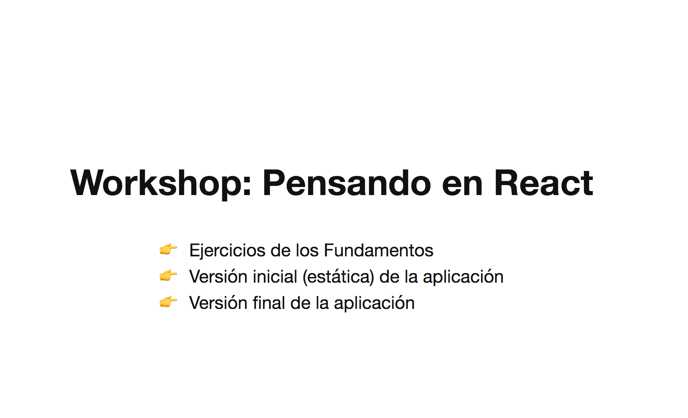

# 00 - Pensando en React - Intro

Conociendo los fundamentos de React podemos construir nuestra primer aplicación. 

Esta parte del workshop está basada en [thinking in react](https://facebook.github.io/react/docs/thinking-in-react.html) de la documentación oficial que describe de forma muy simple y didáctica los pasos que tenemos que hacer para diseñar e implementar una aplicación (o un fragmento dentro de una aplicación) con React.

**Vas a ver que es muy simple, y divertido!**

La aplicación que vamos a construir nos servirá para buscar artistas musicales, e ir armando una lista de artistas favoritos. Para poder utilizar la API de Spotify necesitamos tener una cuenta.

Acá te muestro un GIF con la aplicación funcionando:


Para correr el proyecto tenes que ejecutar `npm` o `yarn` start según que módulo uses

Con npm:
```bash
npm start
```

Con yarn:
```bash
yarn start
```

Podés ver la aplicación final ingresando al link `Versión final de la aplicación` del menú principal.



La primera vez que intentes buscar un artista, la aplicación te redireccionará a una página para darle permisos a la aplicación para acceder a los datos de Spotify. Por como funciona la API de Spotify, esto lo tendrás que hacer cada cierto tiempo. Igualmente esa funcionalidad ya esta implementada, no nos enfocaremos en hacer eso, sino en la UI y las interacciones.

Para comenzar, vamos a ver cómo [dividir nuestra aplicación en componentes](./01-dividir-en-componentes.md).