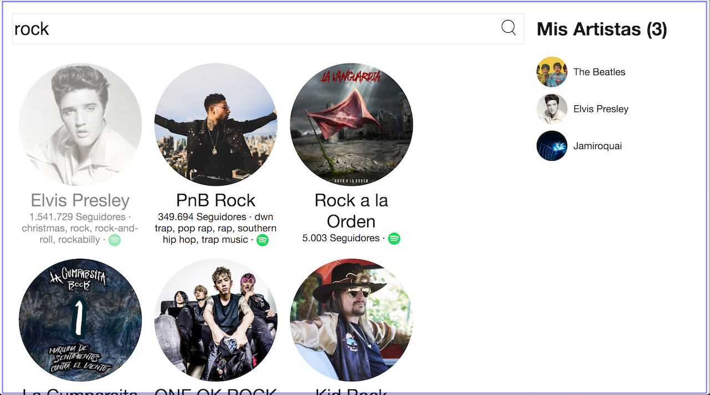
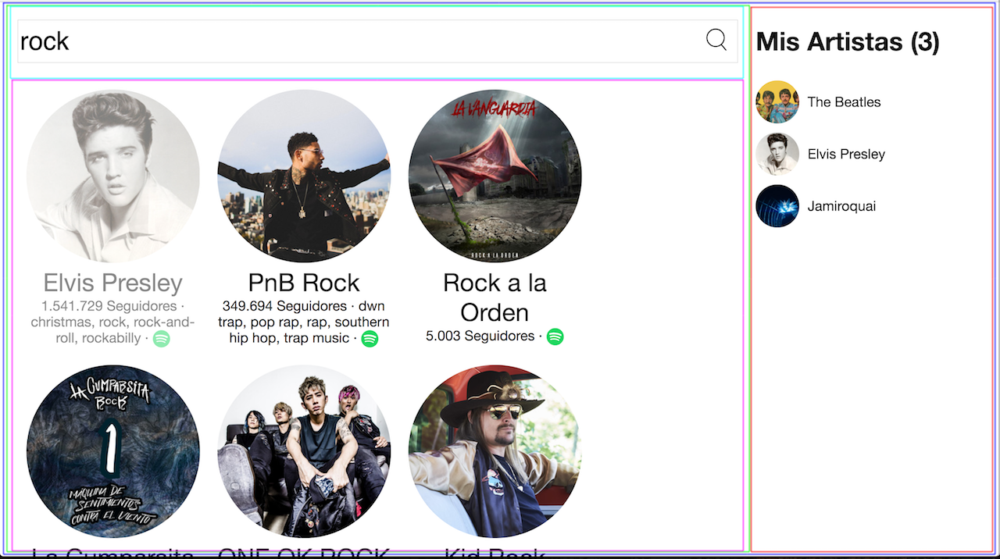

# 01 - Dividir la aplicación en componentes

> Este paso no requiere que hayas completado ningún, fundamento.

El primer paso para crear nuestra aplicación es analizar y diseñar cómo vamos a dividir la UI en componentes.

En general vamos a arrancar con un mock o un diseño previo de nuestra aplicación, pero en nuestro caso como ya tenemos la versión final, podemos usar esto como mock.

La idea es ver el mock, e ir decidiendo que fragmentos de esa UI van a ser componentes. Es útil ir dibujando cuadros de distintos colores englobando lo que queremos que sean nuestros componentes.

Cómo dividir en componentes? La idea es aplicar los mismos patrones de diseño que estamos acostumbrados a utilizar en código que no es de UI. Podemos dividir componentes por la responsabilidad, intentando que no tengan que ocuparse de más de una cosa.

Veamos como dividiríamos nuestra aplicación.

En primer lugar, vamos a tener un gran componente que encierra toda la UI, y es donde comienza nuestra aplicación:

Luego podemos dividir nuestra app en dos componentes, el panel de la derecha con el listado de "Mis Artistas", y el componente del lado izquierdo con el contenido principal:

Luego, nos enfocamos en el panel de la izquierda. Identificamos dos secciones que manejan distinta información. Por un lado el listado de artistas, y por otro lado el formulario de búsqueda. Los dividimos en componentes:

Seguimos enfocándonos en el listado de artistas, e identificamos a cada elemento de la lista como su componente, ya que cada uno se encarga de un artista, y podrían ser el mismo componente repetido, ya que la estructura es la misma en cada uno.

Y así podemos seguir partiendo cada fragmento de UI en más y más componentes, hasta donde creamos necesario. El resto de la división es parte del primer paso que tendrás que completar en este workshop. Recordá los estados dinámicos de la aplicación también! Como los estados de "cargando" mientras los artistas se van a buscar a la API, y el estado de "no hay resultados" cuando buscas por algún texto que no corresponde a ningún artista. Finalmente, también está el estado de "cargando" cuando hacemos click en "cargar más" debajo para cargar la siguiente página de datos.

No importa que hagas todo al más preciso detalle en esta etapa, dividir en componentes es útil como paso inicial para tener una idea aproximada de la estructura de nuestra aplicación, pero es totalmente válido modificar esto a medida que vamos implementando todo.

Una vez que llegaste a un punto que crees que dividiste todos los componentes, ya podes ir al siguiente paso, e [implementar una versión estática de la aplicación](./02-crear-version-estatica.md).