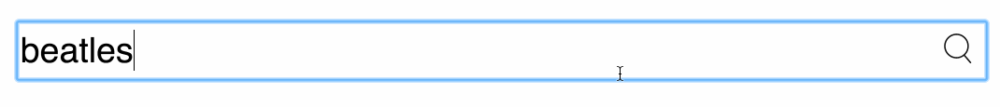
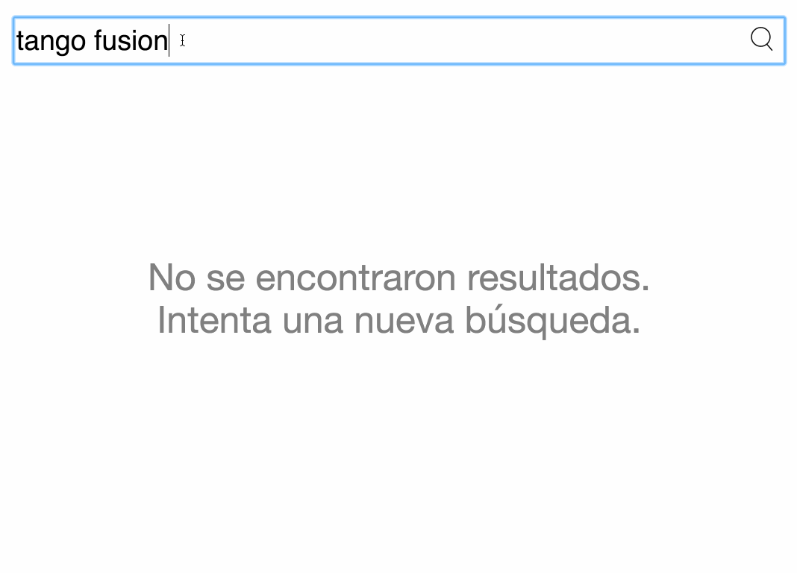
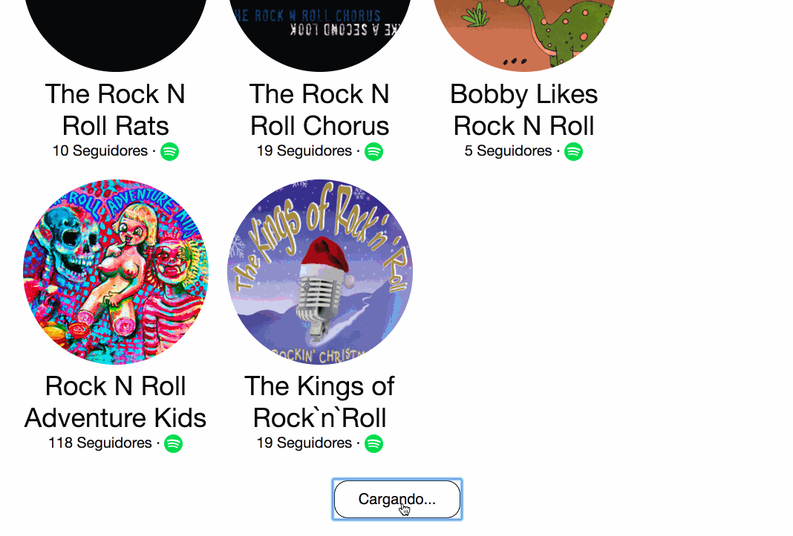
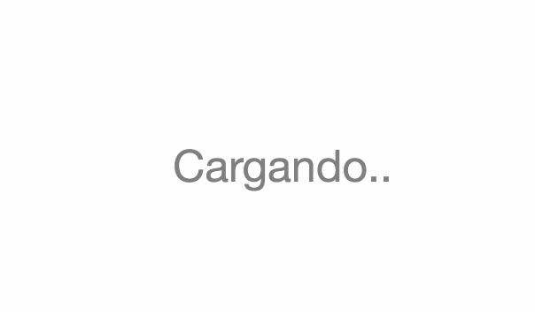
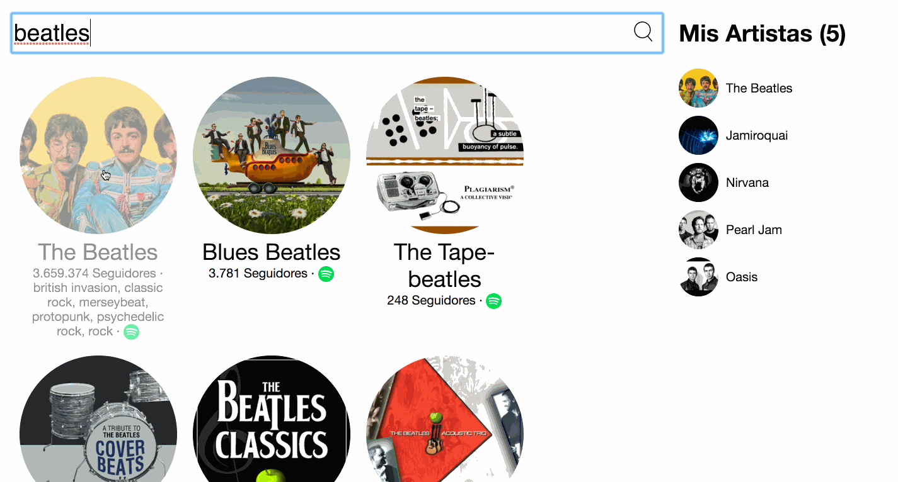

# 03 - Identificar el estado mínimo de nuestra aplicación

> Este paso no requiere que hayas completado ningún, fundamento además de los del paso anterior.

Hasta ahora tenemos nuestra aplicación completamente estática pero que depende de ciertos valores que luego se pasan como `props` por el resto de los componentes, y mientras cambie esos valores, la UI cambiará para reflejar ese nuevo valor. Podés probar esto mismo (si no lo hiciste en el paso anterior) ahora con distintos valores de props.

Ahora este paso es identificar dónde debe vivir el estado de nuestra aplicación. Es decir, debemos ver que datos son los necesarios para dibujar nuestra UI. Este grupo de datos, debe ser una representación mínima, pero completa, de todo lo que puede modificarse en nuestra aplicación.

Qué queremos decir por mínima? Que tenemos que identificar qué datos son los que no se pueden calcular o derivar de otros datos. Por ejemplo, la cantidad de artistas seleccionados no sería parte del estado, ya que si tenemos el listado de artistas seleccionados, podemos calcular la cantidad preguntando por el tamaño de la lista. Por otro lado, todo el estado que no cambia en el tiempo, no es estado. Podemos guardarlo como estado si queremos, pero también podríamos guardarlo como una constante, o como una variable dentro de algún componente directamente.

Para nuestro caso concreto, seguramente la lista de artistas sea parte de ese estado. Debemos tener en algún lado la lista de artistas para poder pasarla por los componentes necesarios para que la dibujen. Pero, hay mas información que necesitamos?

Para esto tenemos que pensar un poco en cómo va a funcionar nuestra aplicación.

En primer lugar, veamos el formulario de búsqueda. Seguramente vamos a tener que saber cuál es el texto por el que busca el usuario, por lo que eso va a ser parte de ese estado, ya que puede modificarse.

Una vez que comencemos a buscar a los artistas, vamos a tener que identificar ese estado intermedio mientras pedimos los datos y efectivamente los obtenemos como respuesta de la API. En ese momento intermedio vamos a estar mostrando la pantalla de "cargando", o modificar el texto del botón de "cargar más" por "cargando". Para esto necesitamos guardar ese booleano que represente el estado de "cargando datos" o no.

Debido a que la información que nos devuelve Spotify está paginada, tenemos que saber cuántos artistas hay en total para una consulta determinada, de forma tal de saber si podemos mostrar o no el boton de "cargar más". Esa información también debe ser parte del estado.

Quizás un detalle un poco sutil, es que la pantalla de "cargando" cuando estamos realizando una nueva búsqueda, muestra los puntos suspensivos usando una animación que va mostrando un punto, luego dos, y luego tres, y luego de nuevo uno, en forma cíclica. Esa información, si bien solo le incumbe a esa parte de nuestra aplicación, también es estado que debemos guardar en algun lado.

Por último, vamos a necesitar el listado de artistas seleccionados para por un lado mostrar en la lista de la derecha, y por otro lado mostrarlos más transparentes cuando se muestran en la búsqueda de la izquierda.

En resumen entonces, tenemos el siguiente estado:

* El listado de artistas actual.
* El texto por el cual estamos buscando artistas.
* Un booleano indicando si estamos esperando una respuesta de la API o no.
* El total de artistas para una consulta.
* El listado de artistas seleccionados.
* Los puntos que estamos mostrando en el componente de "cargando" mientras se anima.

Es importante aclarar que este paso es simplemente para identificar qué estado es el que maneja nuestra aplicación. Ahora el siguiente paso es [ver dónde debe vivir el estado](./04-donde-debe-vivir-el-estado.md)